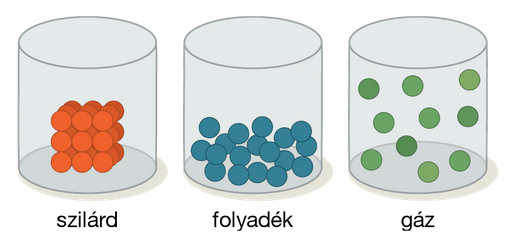

---

> # Atom felépítése
>
> ### Az atom mérete
>
> $6 * 10^{23}db$ atom = 1 mol (mérhető mennyiség)
>
> Viszonyításképp:
> - $2.6 * 10^1 - 7A$ osztálylétszám
> - kb.: $9 * 10^2$ iskolánk létszáma
> - $2 * 10^6$ Budapest lakossága
> - $1.4 * 10^9$ Kína lakossága
> - $7.5 * 10^9$ Föld lakossága
>
> ### Anyagmennyiség
>
> Az anyagi halmazok nagyon sok kémiai részecskéből álló anyagi rendszerek, jellemzésükre jól mérhető fizikai mennyiségeket használunk.
>
> Bármely anyagi halmaz mennyiségét megadhatjuk annak tömegével, térfogatával, anyagmennyiségével és a benne lévő kémiai részecskék számával.
>
> Kémiai szempontból nagyon fontos mennyiség az anyagmennyiség (n). $1 mól$ annak az anyagi rendszernek az anyagmennyisége, amelyben ugyanannyi elemi egység van, mint amennyi atomot tartalmaz $12,0000 g$  $C-12-es$ izotóp. Mivel $12,0000g$ $C-12-es$ izotópban $6 ⋅ 10^{23}$ atom van, minden anyag 1 móljában $6 ⋅ 10^{23}$ (pontosabban $6,022 ⋅ 10^{23}$) elemi egység található. Elemi egység lehet bármely részecske (proton, neutron, elektron, atom, molekula, ion) vagy részecskék együttese (pl. nátrium­ionok és kloridionok együttese: $NaCl$).
>
> ### Relatív atomtömeg
>
> A relatív atomtömeg megadja, hogy egy atom tömege hányszor nagyobb egy szénatom tömegének egytizenketted részénél. Tehát bármely atom egy móljának tömege megegyezik az illető atom relatív atomtömegének grammokban kifejezett értékével. Az anyagok 1 móljának tömegét moláris tömegnek nevezzük.
>
> ### Töltések
>
> - pozitív - proton ($p+$)
> - negatív - elektron ($e-$)
> - semleges - neutron ($n$)
>
> Proton szám egyenlő az elektronok számával
>
> Legegyszerűbb atom: $H$ 1 proton és 1 elektron

---

> # Az elektronburok szerkezete
>
> Nem lehet megmondani, hogy egy elektron hol tartózkodik, de kiszámítható, hogy az elektron egy adott pillanatban milyen valószínűséggel található meg. Ezt nevezzük **tartózkodási valószínűségnek**.
>
> Az atommag körül azt a részt, ahol az elektronok 90%-os valószínűséggel megtalálhatóak, **atompályá**nak nevezzük.
>
> Az atomban kötött elektron energiáját a **pályaenergiá**val jellemezzük. A pályaenergia akkor szabadul fel, ha az elektron a magtól igen nagy távolságból az adott atompályára lép. Mértékegysége: $\frac{kJ}{mol}$.
>
> A pályaenergia a pálya méretétől és alakjától függ, értéke annál nagyobb, minél messzebb van az elektron az atommagtól és minél bonyolultabb alakú pályát hoz létre. A közel azonos méretű atompályákon mozgó elektronok **elektronhéj**at alkotnak.
>
> Az atom legstabilabb állapotát, maikor legkisebb az energiája, az atom **alapállapot**ának nevezzük. Megfelelő energia befektetéssel az elektronok távolabb kerülhetnek az atommagtól, ezt az atom **gerjesztett állapot**ának nevezzük.
>
> Az atomban levő atompályák, illetve az elektronok tulajdonságait a **kvantumszám**okkal jellemezzük. Értékük mindig meghatározott nagyságú. Egy elektron négy kvantumszámmal jellemezhető.
>
> A főkvantumszám jellemzi az elektron atommagtól való távolságát. Jele: n. Értéke: 1,2,3,...egész szám. Az azonos főkvantumszámú atompályák elektronhéjat alkotnak.
>
> A főkvantumszám és a héjak közötti kapcsolat:
>
> | főkvantumszám | héj jelölése |
> | :-- | :-- |
> | 1 | K |
> | 2 | L |
> | 3 | M |
> | 4 | N |
> | 5 | O |
>
> A mellékkvantumszám az atompálya térbeli alakját jellemzi. Jele: l. Értéke: 0,1,2,...n-1 közötti egész szám lehet. Az értékeit általában betűkkel jelöljük.
>
> | számokkal | betűkkel |
> | :-- | :-- |
> | 0 | s |
> | 1 | p |
> | 2 | d |
> | 3 | f |
>
> Egy adott héjon belül az azonos mellékkvantumszámú pályák, alhéjakat képeznek.
>
> Mágneses kvantumszám a mellékkvantumszám által meghatározott alakú atompálya térbeli irányát adja meg. Jele: m. Értéke: $-l$-től $+l$-ig minden egész szám.
>
> 29.oldal (30)
>
> | Főkvantumszám | mellékkvantumszám | mágneses kvantumszám | elektronhéj | alhéj jelölés | atompályák száma | elektronok maximális száma |
> | :-: | :-: | :-: | :-: | :-: | :-: | :-: |
> | 1 | 0 | 0 | K | 1s | 1 | 2 |
> | 2 | 0 1 | 0 -1, 0, +1 | L | 2s 2p | 1 &nbsp;&nbsp;&nbsp;&nbsp;&nbsp;&nbsp;4 3 | 2 &nbsp;&nbsp;&nbsp;&nbsp;&nbsp;&nbsp;8 6 |
> | 3 | 0 1 2 | 0 -1, 0, +1 -2, -1, 0, +1, +2 | M | 3s 3p 3d | 1 3&nbsp;&nbsp;&nbsp;&nbsp;&nbsp;&nbsp;9  | 2 6&nbsp;&nbsp;&nbsp;&nbsp;&nbsp;&nbsp;18 10 |
> | 4 | 0 1 2 3 | 0 -1, 0, +1 -2, -1, 0, +1, +2 -3, -2, -1, 0, +1, +2, +3 | N | 4s 4p 4d 4f | 1 3 &nbsp;&nbsp;&nbsp;&nbsp;&nbsp;&nbsp;16 5 7 | 2 6 &nbsp;&nbsp;&nbsp;&nbsp;&nbsp;&nbsp;32 10 14 |

---

> # A halmazállapotok jellemzése és a halmazállapot-változások
>
> |  | Szilárd | Folyadék | Gáz |
> | :-- | :-- | :-- | :-- |
> | Részecskék mozgása | rezgő-forgó mozgás | rezgő-forgó mozgás, a részecskék elgördülnek egymáson | rezgő-forgó mozgás, egyenes vonalú egyenletes mozgás az ütközések között |
> | Részecskék közötti távolság | kicsi| kicsi | nagy |
> | Diffúzió | nincs (amorf anyagoknál csekély mértékű) | van, a diffúzió sebessége kisebb, mint a gázokban | van, a diffúzió sebessége a legnagyobb |
> | Részecskék közötti kötés erőssége | erős | erős | elhanyagolható |
> | Alak | állandó | változó, felveszi az edény alakját | változó, kitölti a rendelkezésre álló teret |
> | Térfogat adott hőmérsékleten | állandó (összenyomhatatlan) | állandó (összenyomhatatlan) | változó |
> | Főbb fizikai tulajdonságok |  | felületi feszültség, viszkozitás | Avogadro törvénye |
>
> ### A gázok
>
> A gázok diffúziója a részecskék elkeveredését jelenti, amely a gázok hőmozgásából, illetve a koncentrációkülönbségekből adódik.
>
> Avogadro gáztörvénye kimondja, ha gázokból – anyagi minőségtől függetlenül – azonos térfogatot veszünk azonos nyomáson és hőmérsékleten, akkor azok azonos számú (azonos anyagmennyiségű) részecskét tartalmaznak.
>
> Avogadro törvényéből következik, hogy adott nyomáson és hőmérsékleten a gázok térfogatának és anyagmennyiségének hányadosa állandó – az anyagi minőségtől függetlenül.
>
> Ez a moláris térfogat. Számítása a $V_{m} = \frac{V}{n}$ képlettel történik, mértékegysége: $\frac{dm^{3}}{mol}$.
>
> 