<link rel='stylesheet' href='../../css/styles.css'/>

---

# Matematika

Halmazok

---

Halamazok megadása:
 - elemek felsorolásával: {1,2,3,5,7}
 - megadott utasítással: {10-nél nagyobb páros számok}{12,14,16,...}

Jelölése:

A,B,C halmazok

halmazok elemei: a,b,c

Halmazok elemszám jelölése: $|A|$

|  |  |
| :-- | :-- |
| $\in$ | eleme |
| $a \in A$ | a kis 'a' eleme nagy 'A'-nak |
| $a \notin A$ | a kis 'a' nem eleme nagy 'A'-nak |
| ∃ | létezik |
| $\forall$ | minden |
|  |  |
| **Részhalmaz** |  |
| $B \subset$ | B részhalamaza |
| $B \subset A$ | 'B' részhalmaza 'A'-nak |
|  |  |
| **Számhalmazok** |  |
| Természetes számok | N = {1,2,3,4,5,...} |
| Egész számok | Z = {...,-2,-1,0,1,2,3,...} |

| Halmazműveletek |  |  |  |
| :-- | :-- | :-- | :-- |
| Jelölés | Jelentés | Leírás | Ábra |
| $A \cup B$ | A&nbsp;unió&nbsp;B | mindkét halmaz | 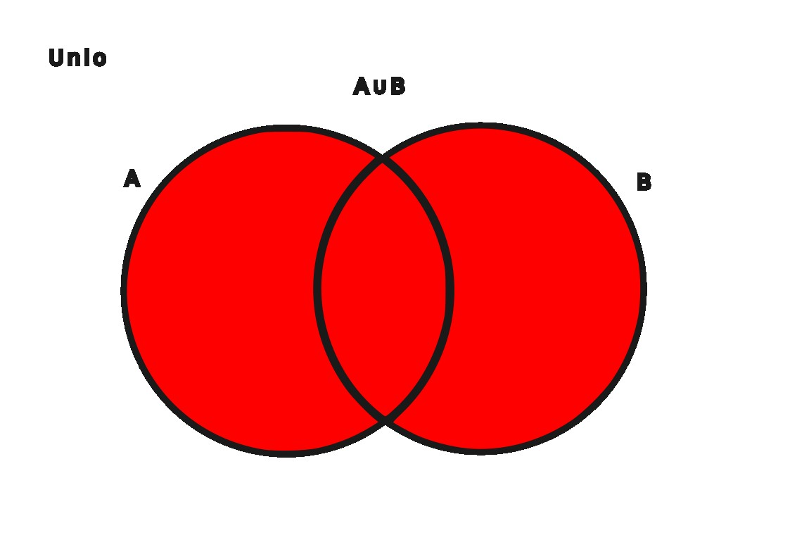 |
| $A \cap B$ | A&nbsp;metszet&nbsp;B | két halmaz közös része | 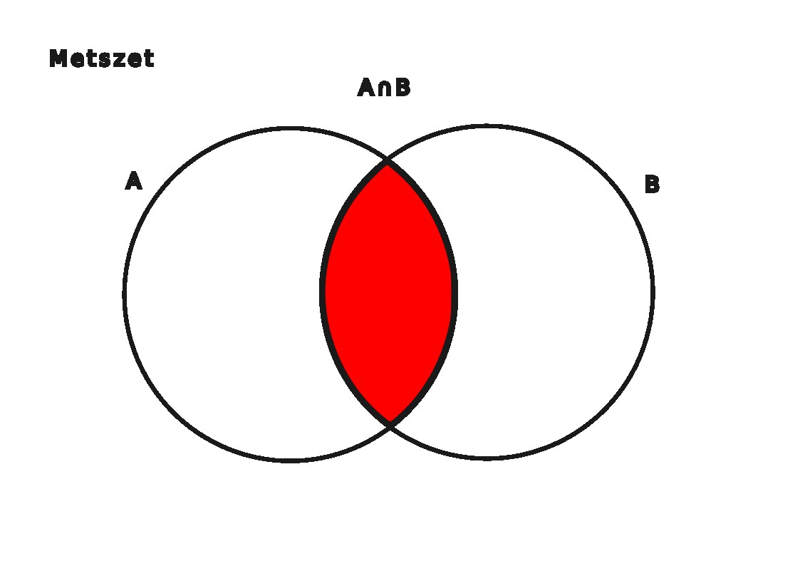 |
| $A$ \ $B$ | A&nbsp;mínusz&nbsp;B | B halmaz kivonása A halmazból | 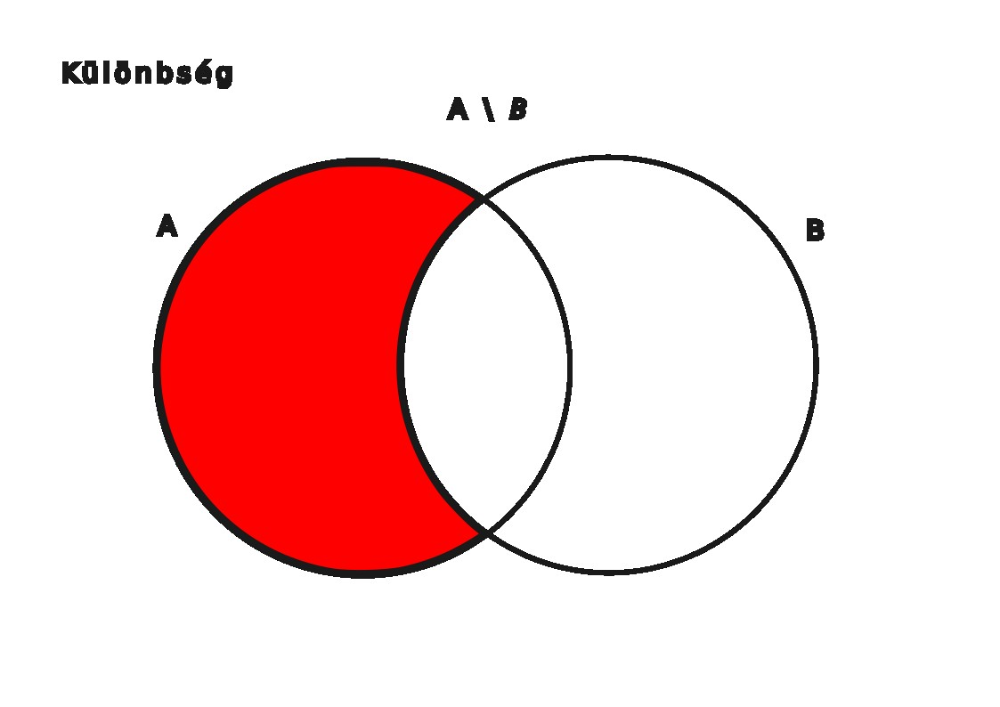 | 
| $B$ \ $A$ | B&nbsp;mínusz&nbsp;A | A halmaz kivonása B halmazból | 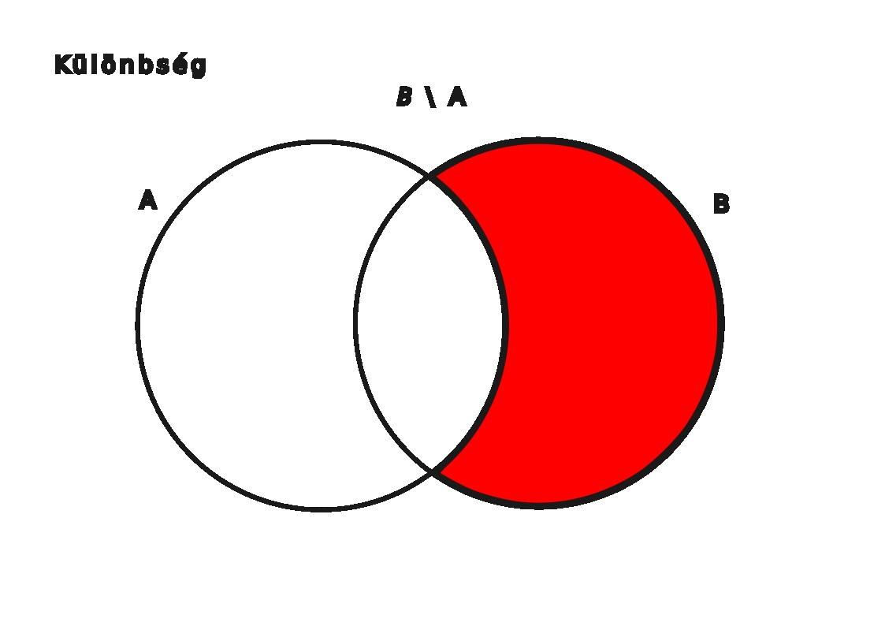 |
| Diszjunkt halamazok | ha a metszetük üres, nincs közös elemük. |  | 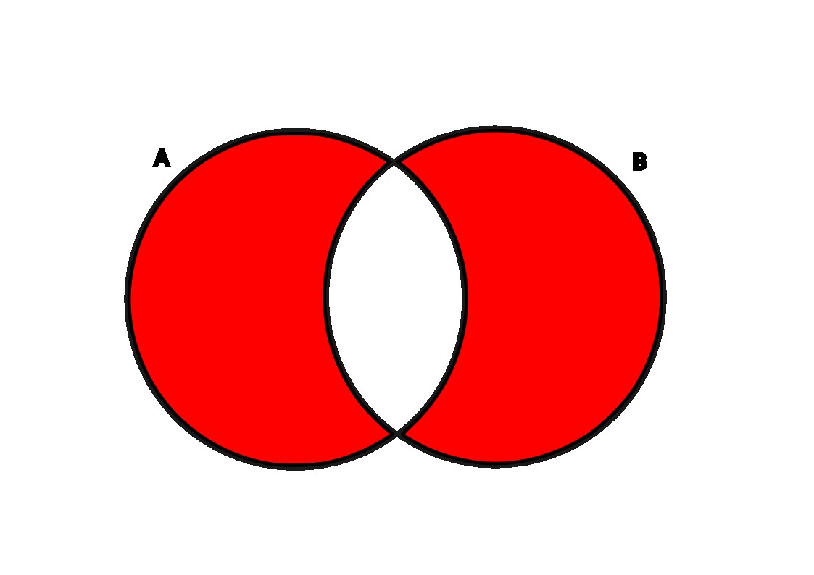 |

***Példák***:

$A$ = {1,2,3,4,5,6}

$B$ = {1,3,5,7,9}

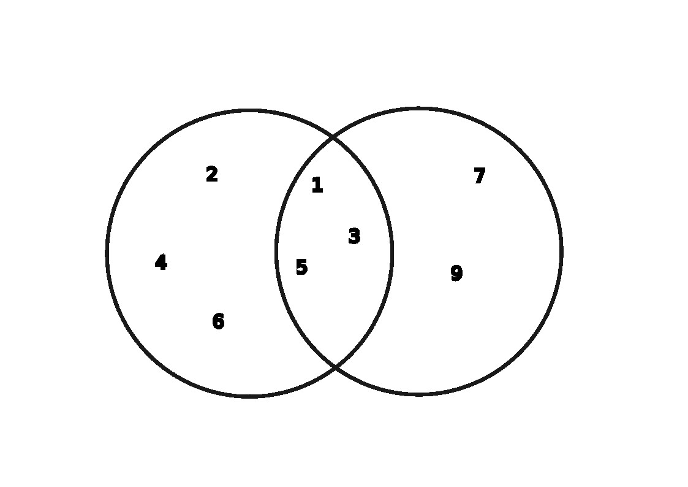

$A \cup B$ = {1,2,3,4,5,6,7,9}

$A \cap B$ = {1,3,5}

$A$ \ $B$ = {2,4,6}

$B$ \ $A$ = {7,9}

---

Számegyenesek, intervallumok

---

- $1 \leqslant x \leqslant 3 \longrightarrow x \in [1;3]$
A lenti képen ábrázolva

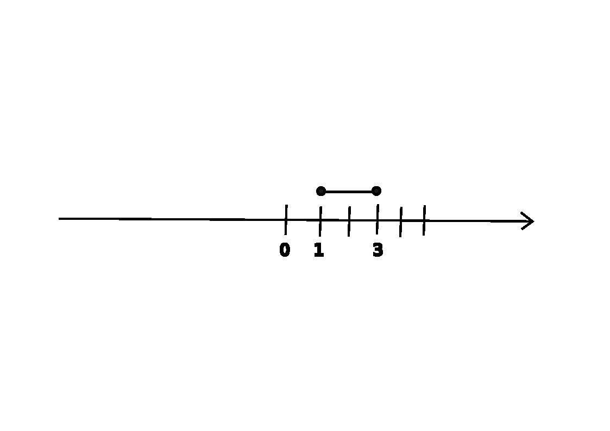

ha $\bullet$ akkor zárt intervallum
 
ha $\circ$ akkor nyitott intervalum

***Példák***:

$A = ${$x|x \in [1;3]$}

$B = ${$x|x \in [2;4]$}

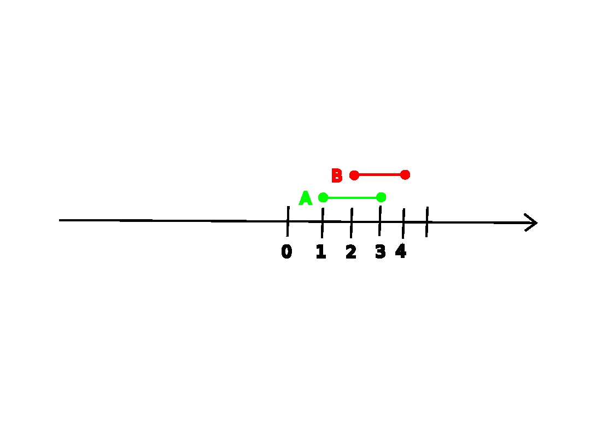

$A \cup B = [1;4]$

$A \cap B = [2;3]$

$A$ \ $B = [1;2[$

$B$ \ $A = ]3;4]$

---

- $A$ = ]-1;2[
- $B$ = [-2;0]

- $A \cup B$ = [-2;2[
- $A \cap B$ = ]-1;0]
- $A$ \ $B$ = ]0;2[
- $B$ \ $A$ = [-2;-1]

---

- $A$ = [-3;2[
- $B$ = ]1;4]

- $A \cup B$ = [-3;4]
- $A \cap B$ = ]1;2[
- $A$ \ $B$ = [-3;1[
- $B$ \ $A$ = ]2;4]

---

- $A$ = [-2;1]
- $B$ = ]-3;3[

- $A \cup B$ = ]-3;3[
- $A \cap B$ = [-2;1]
- $A$ \ $B$ = $\emptyset$
- $B$ \ $A$ = ]-3;-2[ $\cup$ ]1;3[

---

Logikai szita

---

### Halmazok elemszáma

jelölése: $|A|$

pl.:
- $|A|$ =
- $A$ = { kétjegyű négyzetszámok }
- $A$ = {16;25;36;49;64;81}
- $|A|$ = 6

#### 1.Feladat

- Egy pizzaárus 100 egymás utáni pizzarendelést jegyzett fel.
- 60 vásárló kért sajtot is és pepperonit is a pzzájára.
- 80 vásárló sajtot és 72 pepperonit kért a pizzájára.

1. Hányan rendeltek sajtos pizzát pepperoni nélkül?
1. Hányan rendeltek pepperonis pizzát sajt nélkül?
1. Hányan nem kértek se sajtot, se pepperonit a pizzájukra?

* |R| = 100
* |S és P| = 60
* |S| = 80
* |P| = 72

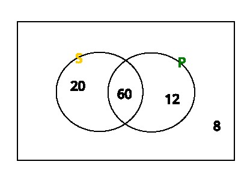

---

#### 2.Feladat

- Az iskolában 75 tanuló jár egy évfolyamra.
- 16-an tanulnak angolul, franciául és németül is,
- 24-en angolul és németül.
- 30-an angolul és franciául,
- 22-en franciául és németül.
- 7 olyan tanuló van, akik csak angolul tanul,
- 5 csak franciául
- és 10 csak németül

1. Összesen hányan tanulnak angolul?
1. Hányan vannak azok, akik angolul és franciául tanulnak, de nem tanulnak németül?
1. Hányan vannak azok, akik egyik nyelvet sem tanulják ezek közül?

* |A| = 7
* |F| = 5
* |N| = 10
* |A és F és N| = 16
* |A és F| = 30
* |A és N| = 24
* |F és N| = 22

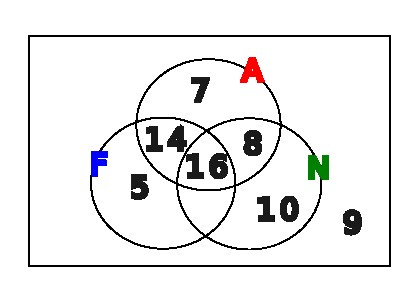

---

#### 3.Feladat

- A kosárlabda bajnokság egy fordulójában összeszámolták, hogy hány játékos szerzett pontot kétpontos dobással a mezőnyből, hárompontos dobással a mezőnyből, illetve büntetőből.
- 70 játékos dobott kétpontos kosarat a mezőnyből,
- 44 játékos dobott hármopontos kosarat a mezőnyből
- és 32 játékos szerzett pontot büntetőből.
- 19-en dobtak a mezőnyből kétpontos és hárompontos kosarat is,
- 16-an dobtak kétpontos kosarat a mezőnyből és szereztek pontot büntetőből is.
- 21-en dobtak hárompontos kosarat a mezőnyből és szereztek pontot büntetőből,
- valamint 6-an szereztek pontot mindháromfléleképpen.

* |KP| = 70
* |HP| = 44
* |B| = 32
* |KP és HP| = 19
* |KP és B| = 16
* |HP és B| = 21

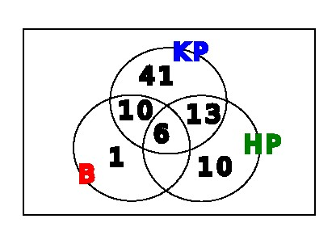

---

Betűk használata a matematikában

---

jelölés: a,b,c,x,y,z,...

lehet:
- egyismeretlenes: 7x + 2
- többismeretlenes: 7x + 8y

### Hatványozás

$3 + 3 + 3 + 3 + 3 = 5 * 3$

$3 * 3 * 3 * 3 * 3 = 3^{5}$

$3^{2} * 3^{4} = 3^{2+4} = 3^{6}$

#### álatlánosan
1. $a^{n} * a^{m} = a^{n+m}$
1. $\frac{a^n}{a^m} = a^{n-m}$
1. $(a^k)^{n} = a^{k*n}$
1. $(a * b)^{n} = a^{n} * b^{n}$
1. $(\frac{a}{b})^{n} = \frac{a^n}{b^n}$

- szorzás: $xy = x * y$&nbsp;&nbsp;&nbsp;pl.: 2 * 3
- helyi érték: $\overline{xy} = xy$&nbsp;&nbsp;&nbsp;pl.: 23

### példák, feladatok

#### példák:
$(2^3 * 5)^3 = (2^3)^3 * 5^3 = 2^9 * 5^3$

$\frac{(7^3)^{5}}{7^{12}} = \frac{7^15}{7^{12}} = 7^{15-12} = 7^3$

$(a^2 b)^3 = (a^2)^3 b^3 = a^6 b^3$

#### feladatok:
1. $(a^7)^3 (a^4)^5 = a^{21} a^{20} = a^{41}$
1. $[(x^2)^2]^3 * [(x^3)^2]^4 = x^{12} * x^{24} = x^{36}$
1. $\frac{(x^3)^5 * x^8}{(x^4)^3} = \frac{x^{15} * x^8}{x^{12}} = \frac{x^{23}}{x^{12}} = x^{23-12} = x^{11}$

---

---

[Vissza](../../../README.md)

---
