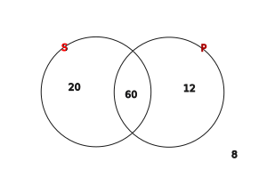
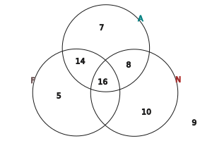
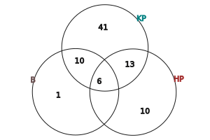

---

- [Vissza az előző oldalra](../matematika.md)
- [Vissza a főoldalra](../../../../README.md)

---

### Halmazok elemszáma

jelölése: $|A|$

pl.:
- $|A|$ =
- $A$ = { kétjegyű négyzetszámok }
- $A$ = {16;25;36;49;64;81}
- $|A|$ = 6

#### 1.Feladat

- Egy pizzaárus 100 egymás utáni pizzarendelést jegyzett fel.
- 60 vásárló kért sajtot is és pepperonit is a pzzájára.
- 80 vásárló sajtot és 72 pepperonit kért a pizzájára.

1. Hányan rendeltek sajtos pizzát pepperoni nélkül?
1. Hányan rendeltek pepperonis pizzát sajt nélkül?
1. Hányan nem kértek se sajtot, se pepperonit a pizzájukra?

* |R| = 100
* |S és P| = 60
* |S| = 80
* |P| = 72

---

#### 2.Feladat

- Az iskolában 75 tanuló jár egy évfolyamra.
- 16-an tanulnak angolul, franciául és németül is,
- 24-en angolul és németül.
- 30-an angolul és franciául,
- 22-en franciául és németül.
- 7 olyan tanuló van, akik csak angolul tanul,
- 5 csak franciául
- és 10 csak németül

1. Összesen hányan tanulnak angolul?
1. Hányan vannak azok, akik angolul és franciául tanulnak, de nem tanulnak németül?
1. Hányan vannak azok, akik egyik nyelvet sem tanulják ezek közül?

* |A| = 7
* |F| = 5
* |N| = 10
* |A és F és N| = 16
* |A és F| = 30
* |A és N| = 24
* |F és N| = 22

---

#### 3.Feladat

- A kosárlabda bajnokság egy fordulójában összeszámolták, hogy hány játékos szerzett pontot kétpontos dobással a mezőnyből, hárompontos dobással a mezőnyből, illetve büntetőből.
- 70 játékos dobott kétpontos kosarat a mezőnyből,
- 44 játékos dobott hármopontos kosarat a mezőnyből
- és 32 játékos szerzett pontot büntetőből.
- 19-en dobtak a mezőnyből kétpontos és hárompontos kosarat is,
- 16-an dobtak kétpontos kosarat a mezőnyből és szereztek pontot büntetőből is.
- 21-en dobtak hárompontos kosarat a mezőnyből és szereztek pontot büntetőből,
- valamint 6-an szereztek pontot mindháromfléleképpen.

* |KP| = 70
* |HP| = 44
* |B| = 32
* |KP és HP| = 19
* |KP és B| = 16
* |HP és B| = 21

---

- [Vissza az előző oldalra](../matematika.md)
- [Vissza a főoldalra](../../../../README.md)

---