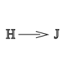
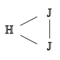
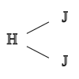

# Hangalak és jelentés kapcsolata

> A nyelvi nyelven a hangalak és a jelentés kapcsolata általában önkényes és szokásszerű megállapodáson alapul. Kivételt képeznek a hangutánzó és a hangulatfestő szavak, mert alakjuk és jelentésük között a kapcsolat szükségszerű és okszerű. A hangalakjukból következtetni lehet a jelentésükre.
>
> 
> 
> pl.:
> - hangutánzó: kakukk, cincog, ...
> - hangulatfestő: csattog, biceg, ...
>
> ## Egyjelentésű szavak
> 
> a hangalakhoz csak egyetlen jelntés kapcsolódik
>
> 
>
> pl.: műanyag, hétfő, ...
>
> ## Többjelentésű szavak
>
> a szó hangalakjához többfélejelentés fűződik, ezek közül az egyik alapjelentés, a többi a későbbiekben kialakult, de vele összefüggő mellékjelentés.
>
> 
> 
> pl.: levél, toll, körte, gerinc, ...
>
> ## Azonos alakú szavak (homonímák)
>
> a hangalak véletlenül azonos, de jelentésük teljesen más, s a jelentésük között nincs összefüggés.
>
> 
>
> pl.: nyúl, vár, fog, ég, ...
>
> ## Rokon értelmű szavak (szinonimák)
>
> eltérő hangalakokkal, azonos jelentést fejeznek ki.
>
> 
>
> pl.:
> - öreg, vén, agg, koros
> - fut, szalad, rohan