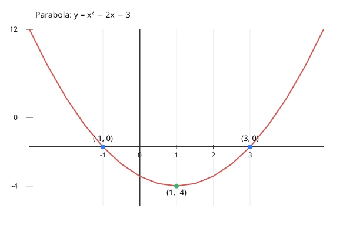

---

[Vissza](../matematika.md)

---

# Első negyedéves vizsga

## Gyökvonás
- $\sqrt{9} = 3 \text{, mert } 3^{2} = 9$
- $\sqrt{16} = 4 \text{, mert } 4^{2} = 16$

Páros gyökvonásnál kikötés kell:
- $K: a \ge 0 \implies (\sqrt[n]{a})^{n} = a$

Páratlan gyökvonásnál nem kell kikötés:
- $(\sqrt[3]{a})^{3} = a$

### Általános alakja:
$\sqrt[n]{a} = b$, ha $b^{n} = a$
- $a$ = alap (gyök alatti szám)
- $n$ = gyök fokszáma (ha nincs kiírva, $n = 2$)
- $b$ = gyökérték

### Műveletek gyökökkel
Szorzat vagy osztás esetén a gyök szétbontható:

$\sqrt[n]{a \cdot b} = \sqrt[n]{a} \cdot \sqrt[n]{b}$
                
**Példák**:
- $\sqrt[3]{8x^{3}} = \sqrt[3]{8} \cdot \sqrt[3]{x^{3}} = 2x$
- $\sqrt[4]{16a^{4} \cdot b^{8}} = 2ab^{2}$
- $\sqrt[5]{\frac{32a^{10}}{b^{5}}} = \frac{2a^{2}}{b}$

**VIGYÁZAT!** Összeadásnál és kivonásnál nem bontható szét:  
$\sqrt[n]{a \pm b} \neq \sqrt[n]{a} \pm \sqrt[n]{b}$

**Példa**:
- $\sqrt{9+16} = 5$, de $\sqrt{9}+\sqrt{16} = 7$.
- A gyökvonás nem disztributív az összeadásra.

## Algebrai gyökvonás
A gyök felírható törtkitevős hatványként is:
$\sqrt[n]{a^{m}} = a^{\frac{m}{n}}$

**Példa**:

$\sqrt[5]{b^{3}} = b^{\frac{3}{5}}$
- $p$ (számláló) = hatványkitevő
- $q$ (nevező) = gyök fokszáma</li>

## Kiemelés a gyökjel alól
**Példa**: $\sqrt[4]{32}+\sqrt[4]{162}$
1. Feltörés: $\sqrt[4]{16 \cdot 2} + \sqrt[4]{81 \cdot 2}$
1. Szétbontás: $\sqrt[4]{16} \cdot \sqrt[4]{2} + \sqrt[4]{81} \cdot \sqrt[4]{2}$
1. Egyszerűsítés: $2\sqrt[4]{2} + 3\sqrt[4]{2}$
1. Összevonás: $5\sqrt[4]{2}$

## Másodfokú egyenlet három alakja
### 1. Általános alak
$ax^{2} + bx + c = 0$

**Példa**: $x^{2} - 2x - 3 = 0 \implies x_1 = 3, x_2 = -1$

Megoldás a megoldóképlettel: $x_{1,2} = \frac{-b \pm \sqrt{b^{2} - 4ac}}{2a}$

### 2. Szorzat alak (Gyöktényezős alak)
$a(x-x_1)(x-x_2) = 0$

**Példa**: $(x-3)(x+1) = 0$

Ez az alak közvetlenül megmutatja a zérushelyeket ($3$ és $-1$).

### 3. Teljes négyzet alak
$a(x-u)^{2} + v = 0$

**Példa**: $(x-1)^{2} - 4 = 0$

Ez az alak a parabola csúcspontját adja meg: $C(1; -4)$.

---
