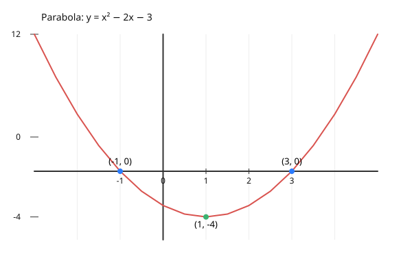

---

[Vissza](../matematika.md)

---

# Első negyedéves vizsga

## Gyökvonás
$$
\begin{aligned}
& \sqrt{9} = 3 \text{, mert } 3^{2} = 9 \\[1em]
& \sqrt{16} = 4 \text{, mert } 4^{2} = 16
\end{aligned}
$$

Páros gyökvonásnál kikötés kell:
$$
\begin{aligned}
& K: a \ge 0 \implies (\sqrt[n]{a})^{n} = a
\end{aligned}
$$

Páratlan gyökvonásnál nem kell kikötés:
$$
\begin{aligned}
& (\sqrt[3]{a})^{3} = a
\end{aligned}
$$

### Általános alakja:
$$
\begin{aligned}
\sqrt[n]{a} = b\text{, ha }b^{n} = a
\end{aligned}
$$

- $a$ = alap (gyök alatti szám)
- $n$ = gyök fokszáma (ha nincs kiírva, $n = 2$)
- $b$ = gyökérték

### Műveletek gyökökkel
Szorzat vagy osztás esetén a gyök szétbontható:

$$
\begin{aligned}
& \sqrt[n]{a \cdot b} = \sqrt[n]{a} \cdot \sqrt[n]{b}
\end{aligned}
$$

#### Példák:
$$
\begin{aligned}
& \sqrt[3]{8x^{3}} = \sqrt[3]{8} \cdot \sqrt[3]{x^{3}} = 2x \\[1em]
& \sqrt[4]{16a^{4} \cdot b^{8}} = 2ab^{2} \\[1em]
& \sqrt[5]{\frac{32a^{10}}{b^{5}}} = \frac{2a^{2}}{b} \\[2em]
& \text{VIGYÁZAT!!! Összeadásnál és kivonásnál nem bontható szét:} \\[1em]
& \sqrt[n]{a \pm b} \neq \sqrt[n]{a} \pm \sqrt[n]{b}
\end{aligned}
$$

#### Példa:
$$
\begin{aligned}
& \sqrt{9+16} = 5\text{, de }\sqrt{9}+\sqrt{16} = 7 \\[1em]
& \text{A gyökvonás nem disztributív az összeadásra.}
\end{aligned}
$$

## Algebrai gyökvonás
A gyök felírható törtkitevős hatványként is:
$$
\begin{aligned}
& \sqrt[n]{a^{m}} = a^{\frac{m}{n}}
\end{aligned}
$$

### Példa:
$$
\begin{aligned}
& \sqrt[5]{b^{3}} = b^{\frac{3}{5}}
\end{aligned}
$$

- $p$ (számláló) = hatványkitevő
- $q$ (nevező) = gyök fokszáma

## Kiemelés a gyökjel alól
### Példa:
$$
\begin{aligned}
& \sqrt[4]{32}+\sqrt[4]{162} \\[2em]
& \text{1. Feltörés: } \sqrt[4]{16 \cdot 2} + \sqrt[4]{81 \cdot 2} \\[1em]
& \text{2. Szétbontás: } \sqrt[4]{16} \cdot \sqrt[4]{2} + \sqrt[4]{81} \cdot \sqrt[4]{2} \\[1em]
& \text{3. Egyszerűsítés: } 2\sqrt[4]{2} + 3\sqrt[4]{2} \\[1em]
& \text{4. Összevonás: } 5\sqrt[4]{2}
\end{aligned}
$$

## Másodfokú egyenlet három alakja
### 1. Általános alak
$$
\begin{aligned}
& ax^{2} + bx + c = 0
\end{aligned}
$$

#### Példa:
$$
\begin{aligned}
& x^{2} - 2x - 3 = 0 \implies x_1 = 3, x_2 = -1
\end{aligned}
$$

Megoldás a megoldóképlettel: $x_{1,2} = \frac{-b \pm \sqrt{b^{2} - 4ac}}{2a}$

### 2. Szorzat alak (Gyöktényezős alak)
$$
\begin{aligned}
& a(x-x_1)(x-x_2) = 0
\end{aligned}
$$

#### Példa:
$$
\begin{aligned}
& (x-3)(x+1) = 0
\end{aligned}
$$

Ez az alak közvetlenül megmutatja a zérushelyeket ($3$ és $-1$).

### 3. Teljes négyzet alak
$$
\begin{aligned}
& a(x-u)^{2} + v = 0
\end{aligned}
$$

#### Példa:
$$
\begin{aligned}
& (x-1)^{2} - 4 = 0
\end{aligned}
$$

Ez az alak a parabola csúcspontját adja meg: $C(1; -4)$.

---

[Vissza](../matematika.md)

---
