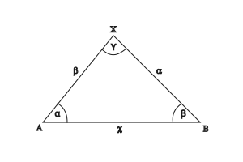

---

# Szinusztétel

## Háromszög trigonometrikus képlete
A háromszög területe egyenlő két oldal hosszának és az általuk közbezárt szög szinusza szorzatának felével egyenlő.

$\frac{a \cdot b \cdot \sin\gamma}{2} = \frac{a \cdot c \cdot \sin\beta}{2} = \frac{b \cdot c \cdot \sin\alpha}{2}$

$$
\begin{aligned}
\frac{a \cdot b \cdot \sin\gamma}{2} = \frac{b \cdot c \cdot \sin\alpha}{2} \quad /\cdot 2  && /\cdot b \\
\frac{a}{c} = \frac{\sin\alpha}{\sin\gamma} \\
\frac{b}{c} = \frac{\sin\beta}{\sin\gamma} \\
\frac{a}{b} = \frac{\sin\alpha}{\sin\beta}
\end{aligned}
$$

A háromszögben két oldal hosszának aránya egyenlő a velük szemközti szögek szinuszának arányával.

---

## Feladatok
$$
\begin{aligned}
a = 3 && \| && \alpha = 30^{\circ} \\
b = ? && \| && \beta = 70^{\circ} \\
c = ? && \| && \gamma = ? \\
\\\\
\gamma = 180^{\circ} - (30^{\circ} + 70^{\circ}) = 80^{\circ} \\
\\\\
b = \frac{b}{a} = \frac{\sin70^{\circ}}{\sin30^{\circ}} \cdot a = \\
\\
= \frac{0.9396}{0.5} \cdot 3 = 1.8792 \cdot 3 = 5.6376 \\
\\\\
c = \frac{c}{a} = \frac{\sin\gamma}{\sin\alpha} \cdot a = \\
\\
= \frac{0.9848}{0.5} \cdot 3 = 1.9696 \cdot 3 = 5.9088
\end{aligned}
$$

---

$$
\begin{aligned}
a = 3 && \| && \alpha = 45^{\circ} \\
b = 4 && \| && \beta = ? \\
c = ? && \| && \gamma = ? \\
\\\\
\beta_{1} = 4 \cdot \frac{\sin\alpha}{3} = 4 \cdot \frac{\sin45^{\circ}}{3} = \frac{0.7071}{3} = 1.2357 \cdot 4 = 70.53^{\circ} \\
\\\\
\gamma = 180^{\circ} - (45^{\circ} + 70.53^{\circ}) = 64.47^{\circ} \\
\\\\
c_{1} = \frac{\sin\gamma}{\sin\alpha} \cdot a = \frac{\sin64.47^{\circ}}{\sin45^{\circ}} \cdot 3 = \frac{0.9023}{0.7071} \cdot 3 = 1.2761 \cdot 3 = 3.8281 \\
\\\\
\\\\
a_{1,2} = 3 \\
b_{1,2} = 4 \\
\alpha = 45^{\circ} \\
\beta_{2} = 180^{\circ} - 70.53^{\circ} = 109.47^{\circ} \\
\gamma_{2} = 25.53^{\circ} \\
\\\\
c_{2} = \frac{\sin\gamma}{\sin\alpha} \cdot a = \frac{\sin25.53^{\circ}}{\sin45^{\circ}} \cdot 3 = \frac{4.4309}{0.7071} \cdot 3 = 6.2662 \cdot 3 = 18.80^{\circ}
\end{aligned}
$$

## Lecke
### 3299. feladat
Egy háromszög oldalainak hossza $a$, $b$ és $c$.

A velük szemben lévő belső szögek rendre $\alpha$, $\beta$ és $\gamma$.

Töltsük ki a következő táblázatot.

| sor | a | b | c | $\alpha$ | $\beta$ | $\gamma$ |
| :-: | :-: | :-: | :-: | :-: | :-: | :-: |
| **1.** | $5cm$ |  |  |  | $45^{\circ}$ | $62^{\circ}$ |
| **2.** |  |  | $9m$ | $12^{\circ}$ | $74^{\circ}$ |  |
| **3.** |  | $4dm$ |  | $51^{\circ}$ |  | $73^{\circ}$ |

#### 1.sor:
$$
\begin{aligned}
a = 5cm && \| && \alpha = ? \\
b = ? && \| && \beta = 45^{\circ} \\
c = ? && \| && \gamma = 62^{\circ} \\
\\\\
\alpha = 180^{\circ} - (45^{\circ} + 62^{\circ}) = 180^{\circ} - 107^{\circ} = 73^{\circ} \\
\\\\
b = \frac{b}{a} \cdot a = \frac{\sin\beta}{\sin\alpha} \cdot 5 = \frac{\sin45^{\circ}}{\sin73^{\circ}} \cdot 5 = \frac{0.7071}{0.9563} \cdot 5 = 0.7394 \cdot 5 = 3.7cm \\
\\\\
c = \frac{c}{a} \cdot a = \frac{\sin\gamma}{\sin\alpha} \cdot a = \frac{\sin62^{\circ}}{\sin73^{\circ}} \cdot 5 = \frac{0.8829}{0.9563} \cdot 5 = 0.9232 \cdot 5 = 4.62cm
\end{aligned}
$$

#### 2.sor:
$$
\begin{aligned}
a = ? && \| && \alpha = 12^{\circ} \\
b = ? && \| && \beta = 74^{\circ} \\
c = 9m && \| && \gamma = ? \\
\\\\
\gamma = 180^{\circ} - (12^{\circ} + 74^{\circ}) = 94^{\circ} \\
\\\\
a = \frac{a}{c} \cdot c = \frac{\sin\alpha}{\sin\gamma} \cdot c = \frac{\sin12^{\circ}}{\sin94^{\circ}} \cdot 9 = \frac{0.2079}{0.9975} \cdot 9 = 0.2084 \cdot 9 = 1.8757 \approx 1.88m \\
\\\\
b = \frac{b}{c} \cdot c = \frac{\sin\beta}{\sin\gamma} \cdot c = \frac{\sin74^{\circ}}{\sin94^{\circ}} \cdot 9 = \frac{0.9612}{0.9975} \cdot 9 = 0.9636 \cdot 9 = 8.67m
\end{aligned}
$$

#### 3. sor:
$$
\begin{aligned}
a = ? && \| && \alpha = 51^{\circ} \\
b = 4dm && \| && \beta = ? \\
c = ? && \| && \gamma = 73^{\circ} \\
\\\\
\beta = 180^{\circ} - (51^{\circ} + 73^{\circ}) = 180^{\circ} - 124^{\circ} = 56^{\circ} \\
\\\\
a = \frac{a}{b} \cdot b = \frac{\sin\alpha}{\sin\beta} \cdot b = \frac{\sin51^{\circ}}{\sin56^{\circ}} \cdot 4 = \frac{0.7771}{0.8290} \cdot 4 = 0.9373 \cdot 4 = 3.75dm \\
\\\\
c = \frac{c}{b} \cdot b = \frac{\sin\gamma}{\sin\beta} \cdot b = \frac{\sin73^{\circ}}{\sin56^{\circ}} \cdot 4 = \frac{0.9563}{0.8290} \cdot 4 = 1.1535 \cdot 4 = 4.6142dm
\end{aligned}
$$

### Megoldás:

| sor | a | b | c | $\alpha$ | $\beta$ | $\gamma$ |
| :-: | :-: | :-: | :-: | :-: | :-: | :-: |
| **1.** | $5cm$ | $3.7cm$ | $4.62cm$ | $73^{\circ}$ | $45^{\circ}$ | $62^{\circ}$ |
| **2.** | $1.88m$ | $8.67m$ | $9m$ | $12^{\circ}$ | $74^{\circ}$ | $94^{\circ}$ |
| **3.** | $3.75dm$ | $4dm$ | $4.6142dm$ | $51^{\circ}$ | $56^{\circ}$ | $73^{\circ}$ |

### 3300. feladat
Egy háromszög oldalainak hossza $a$, $b$ és $c$.

A velük szemben levő szögek rendre $\alpha$, $\beta$ és $\gamma$.

Töltsük ki a következő táblázatot.

| a | b | c | $\alpha$ | $\beta$ | $\gamma$ |
| :-: | :-: | :-: | :-: | :-: | :-: |
| $9cm$ | $5cm$ |  | $70^{\circ}$ |  |  |
|  | $12m$ | $8m$ |  | $102^{\circ}$ |  |
| $18dm$ |  | $120cm$ | $65^{\circ}$ |  |  |

---

[Vissza](../matematika.md)

---
