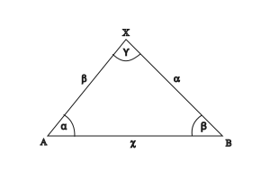

---

# Szinusztétel

## Háromszög trigonometrikus képlete
A háromszög területe egyenlő két oldal hosszának és az általuk közbezárt szög szinusza szorzatának felével egyenlő.

$$
\begin{aligned}
\frac{a \cdot b \cdot \sin\gamma}{2} &= \frac{a \cdot c \cdot \sin\beta}{2} = \frac{b \cdot c \cdot \sin\alpha}{2}
\end{aligned}
$$

$$
\begin{aligned}
\frac{a \cdot b \cdot \sin\gamma}{2} &= \frac{b \cdot c \cdot \sin\alpha}{2} \quad /\cdot 2  && /\cdot b \\
\\\\
\frac{a}{c} &= \frac{\sin\alpha}{\sin\gamma} \\
\\\\
\frac{b}{c} &= \frac{\sin\beta}{\sin\gamma} \\
\\\\
\frac{a}{b} &= \frac{\sin\alpha}{\sin\beta}
\end{aligned}
$$

A háromszögben két oldal hosszának aránya egyenlő a velük szemközti szögek szinuszának arányával.

---

## Feladatok
$$
\begin{array}{|l|l|}
a = 3 & \alpha = 30^{\circ} \\
b = ? & \beta = 70^{\circ} \\
c = ? & \gamma = ?
\end{array}
$$
$$
\begin{aligned}
\\[2em]
\gamma &= 180^{\circ} - (30^{\circ} + 70^{\circ}) = 80^{\circ} \\[1em]
b &= \frac{b}{a} = \frac{\sin70^{\circ}}{\sin30^{\circ}} \cdot a = \frac{0.9396}{0.5} \cdot 3 = 1.8792 \cdot 3 = 5.6376 \\[1em]
c &= \frac{c}{a} = \frac{\sin\gamma}{\sin\alpha} \cdot a = \frac{0.9848}{0.5} \cdot 3 = 1.9696 \cdot 3 = 5.9088
\end{aligned}
$$

---

$$
\begin{array}{|l|l|}
a = 3 & \alpha = 45^{\circ} \\
b = 4 & \beta = ? \\
c = ? & \gamma = ? \\[1em]
\end{array}
$$
$$
\begin{aligned}
\\[2em]
\beta_{1} &= 4 \cdot \frac{\sin\alpha}{3} = 4 \cdot \frac{\sin45^{\circ}}{3} = \frac{0.7071}{3} = 1.2357 \cdot 4 = 70.53^{\circ} \\[1em]
\gamma &= 180^{\circ} - (45^{\circ} + 70.53^{\circ}) = 64.47^{\circ} \\[1em]
c_{1} &= \frac{\sin\gamma}{\sin\alpha} \cdot a = \frac{\sin64.47^{\circ}}{\sin45^{\circ}} \cdot 3 = \frac{0.9023}{0.7071} \cdot 3 = 1.2761 \cdot 3 = 3.8281 \\[2em]
a_{1,2} &= 3 \\
b_{1,2} &= 4 \\
\alpha &= 45^{\circ} \\
\beta_{2} &= 180^{\circ} - 70.53^{\circ} = 109.47^{\circ} \\
\gamma_{2} &= 25.53^{\circ} \\[1em]
c_{2} &= \frac{\sin\gamma}{\sin\alpha} \cdot a = \frac{\sin25.53^{\circ}}{\sin45^{\circ}} \cdot 3 = \frac{4.4309}{0.7071} \cdot 3 = 6.2662 \cdot 3 = 18.80^{\circ}
\end{aligned}
$$

---

## Lecke
### 3299. feladat
Egy háromszög oldalainak hossza $a$, $b$ és $c$.

A velük szemben lévő belső szögek rendre $\alpha$, $\beta$ és $\gamma$.

Töltsük ki a következő táblázatot.

$$
\begin{array}{|c|c|c|c|c|c|c|}
\hline
& a & b & c & \alpha & \beta & \gamma \\
\hline
\text{1.sor} & 5\text{ cm} & & & & 45^{\circ} & 62^{\circ} \\
\hline
\text{2.sor} & & & 9\text{ m} & 12^{\circ} & 74^{\circ} & \\
\hline
\text{3.sor} & & 4dm & & 51^{\circ} & & 73^{\circ} \\
\hline
\end{array}
$$

#### 1.sor:
$$
\begin{array}{|l|l|}
a = 5\text{ cm} & \alpha = \text{?} \\
b = \text{?} & \beta = 45^{\circ} \\
c = \text{?} & \gamma = 62^{\circ} \\
\end{array}
$$
$$
\begin{aligned}
\\[2em]
\alpha &= 180^{\circ} - (45^{\circ} + 62^{\circ}) = 180^{\circ} - 107^{\circ} = 73^{\circ} \\[1em]
b &= \frac{b}{a} = \frac{\sin\beta}{\sin\alpha} \cdot 5 = \frac{\sin45^{\circ}}{\sin73^{\circ}} \cdot 5 = \frac{0.7071}{0.9563} \cdot 5 = 0.7394 \cdot 5 = 3.7cm \\[1em]
c &= \frac{c}{a} = \frac{\sin\gamma}{\sin\alpha} \cdot a = \frac{\sin62^{\circ}}{\sin73^{\circ}} \cdot 5 = \frac{0.8829}{0.9563} \cdot 5 = 0.9232 \cdot 5 = 4.62cm
\end{aligned}
$$

#### 2.sor:
$$
\begin{array}{|l|l|}
a = \text{?} & \alpha = 12^{\circ} \\
b = \text{?} & \beta = 74^{\circ} \\
c = 9\text{ m} & \gamma = \text{?} \\
\end{array}
$$
$$
\begin{aligned}
\\[2em]
\gamma &= 180^{\circ} - (12^{\circ} + 74^{\circ}) = 94^{\circ} \\[1em]
a &= \frac{a}{c} = \frac{\sin\alpha}{\sin\gamma} \cdot c = \frac{\sin12^{\circ}}{\sin94^{\circ}} \cdot 9 = \frac{0.2079}{0.9975} \cdot 9 = 0.2084 \cdot 9 = 1.8757 \approx 1.88m \\[1em]
b &= \frac{b}{c} = \frac{\sin\beta}{\sin\gamma} \cdot c = \frac{\sin74^{\circ}}{\sin94^{\circ}} \cdot 9 = \frac{0.9612}{0.9975} \cdot 9 = 0.9636 \cdot 9 = 8.67m
\end{aligned}
$$

#### 3. sor:
$$
\begin{array}{|l|l|}
a = \text{?} & \alpha = 51^{\circ} \\
b = 4\text{ dm} & \beta = \text{?} \\
c = \text{?} & \gamma = 73^{\circ} \\
\end{array}
$$
$$
\begin{aligned}
\\[2em]
\beta &= 180^{\circ} - (51^{\circ} + 73^{\circ}) = 180^{\circ} - 124^{\circ} = 56^{\circ} \\[1em]
a &= \frac{a}{b} = \frac{\sin\alpha}{\sin\beta} \cdot b = \frac{\sin51^{\circ}}{\sin56^{\circ}} \cdot 4 = \frac{0.7771}{0.8290} \cdot 4 = 0.9373 \cdot 4 = 3.75dm \\[1em]
c &= \frac{c}{b} = \frac{\sin\gamma}{\sin\beta} \cdot b = \frac{\sin73^{\circ}}{\sin56^{\circ}} \cdot 4 = \frac{0.9563}{0.8290} \cdot 4 = 1.1535 \cdot 4 = 4.6142dm
\end{aligned}
$$

### Megoldás:

$$
\begin{array}{|c|c|c|c|c|c|c|}
\hline
& a & b & c & \alpha & \beta & \gamma \\
\hline
1\text{.sor} & 5\text{ cm} & 3.7\text{ cm} & 4.62\text{ cm} & 73^{\circ} & 45^{\circ} & 62^{\circ} \\
\hline
2\text{.sor} & 1.88\text{ m} & 8.67\text{ m} & 9\text{ m} & 12^{\circ} & 74^{\circ} & 94^{\circ} \\
\hline
3\text{.sor} & 3.75\text{ dm} & 4\text{ dm} & 4.6142\text{ dm} & 51^{\circ} & 56^{\circ} & 73^{\circ}
\hline
\end{array}
$$

---

### 3300. feladat
Egy háromszög oldalainak hossza $a$, $b$ és $c$.

A velük szemben levő szögek rendre $\alpha$, $\beta$ és $\gamma$.

Töltsük ki a következő táblázatot.

$$
\begin{array}{|c|c|c|c|c|c|c|}
\hline
& a & b & c & \alpha & \beta & \gamma \\
\hline
1\text{.sor} & 9\text{ cm} & 5\text{ cm} & & 70^{\circ} & & \\
2\text{.sor} & & 12\text{ m} & 8\text{ m} & & 102^{\circ} & \\
3\text{.sor} & 18\text{ dm} & & 120\text{ cm} & 65^{\circ} & & & \\
\end{array}
$$

#### 1. sor:
$$
\begin{aligned}
\\[2em]
a &= 9cm &&|&& \alpha = 70^{\circ} \\
b &= 5cm &&|&& \beta = ? \\
c &= ? &&|&& \gamma = ? \\[1em]
\sin\beta &= b \cdot \frac{sin\alpha}{a} = 5 \cdot \frac{\sin70^{\circ}}{9} = 5 \cdot \frac{0.9396}{9} = 5 \cdot 0.1044 = 0.522 \\[.5em]
\beta &= \sin^{-1}(0.522) = 31.4665^{\circ} \approx 31.47^{\circ} \\[1em]
\gamma &= 180^{\circ} - (70^{\circ} + 31.47^{\circ}) = 180^{\circ} - 101.47^{\circ} = 78.53^{\circ} \\[1em]
c &= \frac{\sin\gamma}{\sin\beta} \cdot b = \frac{\sin78.53^{\circ}}{\sin31.47^{\circ}} \cdot 5 = \frac{0.9800}{0.5221} \cdot 5 = 1.8772 \cdot 5 = 9.3863cm
\end{aligned}
$$

#### 2. sor:
$$
\begin{aligned}
a &= ? &&|&& \alpha = ? \\
b &= 12m &&|&& \beta = 102^{\circ} \\
c &= 8m &&|&& \gamma = ? \\[1em]
\sin\gamma &= \frac{\sin\beta}{b} \cdot c = \frac{\sin102^{\circ}}{12} \cdot 8 = \frac{0.9781}{12} \cdot 8 = 0.0815 \cdot 8 = 0.6521 \\[.5em]
\gamma &= \sin^{-1}(0.6521) = 40.7^{\circ} \\[1em]
\alpha &= 180^{\circ} - (102^{\circ} + 40.7^{\circ}) = 180^{\circ} - 142.7^{\circ} = 37.3^{\circ} \\[1em]
a &= \frac{a}{b} = \frac{\sin\alpha}{\sin\beta} \cdot b = \frac{\sin37.3^{\circ}}{\sin102^{\circ}} \cdot 12 = \frac{6060}{0.9781} \cdot 12 = 0.6196 \cdot 12 = 7.43m
\end{aligned}
$$

#### 3. sor:
$$
\begin{aligned}
a &= 18dm &&|&& \alpha = 65^{\circ} \\
b &= ? &&|&& \beta = ? \\
c &= 120cm = 12dm &&|&& \gamma = ? \\[1em]
\sin\gamma &= \frac{\sin\alpha}{a} \cdot c = \frac{\sin65^{\circ}}{18} \cdot 12 = \frac{0.9063}{18} \cdot 12 = 0.0503 \cdot 12 = 0.6042 \\[.5em]
\gamma &= \sin^{-1}(0.6042) = 37.17^{\circ} \\[1em]
\beta &= 180^{\circ} - (65^{\circ} + 37.17^{\circ}) = 180^{\circ} - 102.17^{\circ} = 77.83^{\circ} \\[1em]
b &= \frac{b}{a} = \frac{\sin\beta}{\sin\alpha} \cdot a = \frac{\sin77.83^{\circ}}{\sin65^{\circ}} \cdot 18 = \frac{0.9775}{0.9063} \cdot 18 = 1.0786 \cdot 18 = 19.41dm
\end{aligned}
$$

### Megoldás:

| sor | a | b | c | $\alpha$ | $\beta$ | $\gamma$ |
| :-: | :-: | :-: | :-: | :-: | :-: | :-: |
| **1.** | $9cm$ | $5cm$ | $9.3863cm$ | $70^{\circ}$ | $31.47^{\circ}$ | $78.53^{\circ}$ |
| **2.** | $7.43m$ | $12m$ | $8m$ | $37.3^{\circ}$ | $102^{\circ}$ | $40.7^{\circ}$ |
| **3.** | $18dm$ | $19.41dm$ | $120cm$ | $65^{\circ}$ | $77.83^{\circ}$ | $37.17^{\circ}$ |

---

## Órai feladatok

### 2022 okt 10. példa (érettségi)
$$
\begin{aligned}
a &= ? &&|&& \alpha = 30^{\circ} \\
b &= 6 &&|&& \beta = ? \\
c &= ? &&|&& \gamma = 100^{\circ} \\[1em]
\beta &= 180^{\circ} - (100^{\circ} + 30^{\circ}) = 50^{\circ} \\[1em]
a &= \frac{\sin 30^{\circ}}{\sin 50^{\circ}} \cdot 6 = \frac{0{,}5}{0{,}766} \cdot 6 \approx 3{,}92 \\[1em]
c &= \frac{\sin \gamma}{\sin \beta} \cdot b = \frac{\sin 100^{\circ}}{\sin 50^{\circ}} \cdot 6 \approx 7{,}71
\end{aligned}
$$

### 2025 május 5. példa
$$
\begin{aligned}
a &= 5 &&|&& \alpha = ? \\
b &= 6 &&|&& \beta = 60^{\circ} \\
c &= ? &&|&& \gamma = ? \\[1em]
\sin\alpha &= \frac{\sin\beta}{b} \cdot a = \frac{\sin60}{6} \cdot 5 = 0.1443 \cdot 5 = 0.7217 \\[.5em]
\alpha &= \sin^{-1}(0.7217) = 46.2^{\circ} \\[1em]
\gamma &= 180^{\circ} - (60^{\circ} + 46.2^{\circ}) = 73.8^{\circ} \\[1em]
c &= \frac{\sin\gamma}{\sin\beta} \cdot b = \frac{\sin73.8^{\circ}}{\sin60^{\circ}} \cdot 6 = 1.1089 \cdot 6 = 6.65
\end{aligned}
$$

---

[Vissza](../matematika.md)

---
