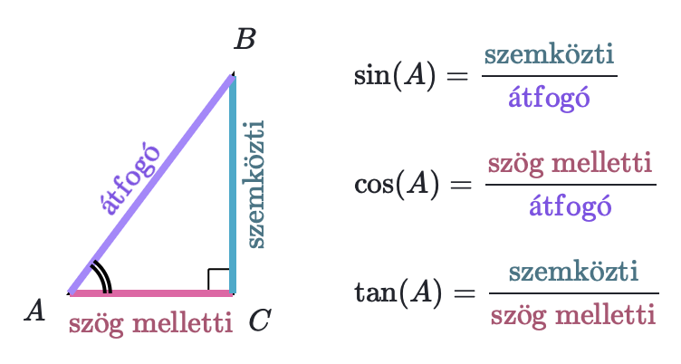
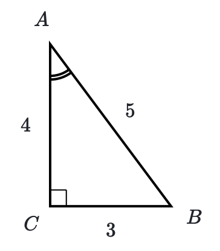
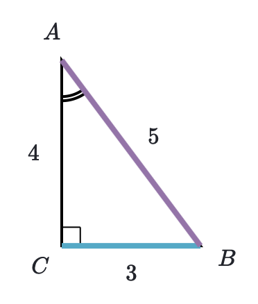

---

# Szögfüggvények
Egy derékszögű háromszög oldalainak hányadosait szögfüggvényeknek nevezzük.

A három legfontosabb szögfüggvény a **szinusz** (sin), **koszinusz** (cos), és a **tangens** (tan vagy tg).

Ezeket az $A$ hegyesszögre az alábbiak szerint definiáljuk:

A fenti definíciókban a szög melletti és a szöggel szemközti befogókon, valamint az átfogón azok hosszát értjük.

## Hogyan jegyezzük meg az arányokat?
A `sziszakomataszem` szó segít megjegyezni a szinusz, koszinusz és tangens definícióját:
- SziSzA: a **Szinusz** a szöggel **Szemközti** befogó per **Átfogó**
    - $sin(A) = \frac{Szemközti befogó}{Átfogó}$
- KoMA: a **Koszinusz** a szög **Melletti** befogó per az **Átfogó**
    - $cos(A) = \frac{Melletti befogó}{Átfogó}$
- TaSzeM: a **Tangens** a **Szemközti** befogó per a **Melletti** befogó
    - $tan(A) = \frac{Szemközti befogó}{Melletti befogó}$

Ha például emlékezni akarunk a szinusz definíciójára, gondoljunk a **SziSzA**-ra, hiszen a szinusz is `szi`-vel kezdődik. Az ezután következő `Sz` és `A` segít.

### Példa
Tegyük fel, hogy meg akarjuk határozni az alábbi $ABC$ háromszög $A$ szögéhez tartozó sin(A) értéket.

A szinuszt a **szemközti befogó** és az **átfogó** hányadosaként definiáltuk (SziSzA), így:

$sin(A) = \frac{szemközti}{átfogó} = \frac{BC}{AB} = \frac{3}{5}$
