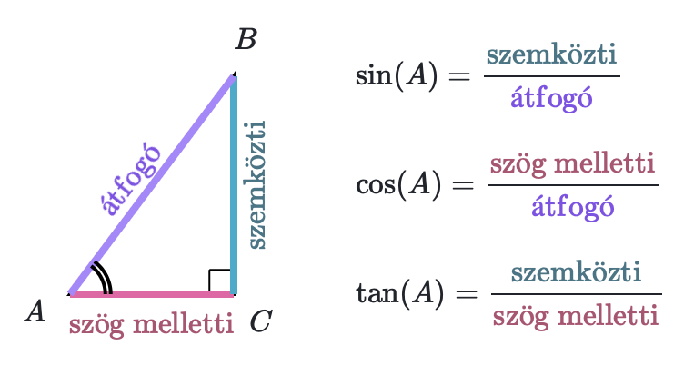
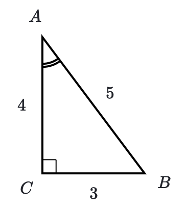
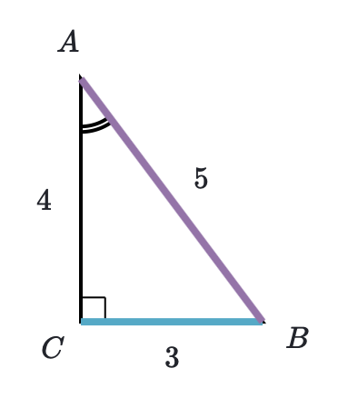

---

# Szögfüggvények
Egy derékszögű háromszög oldalainak hányadosait szögfüggvényeknek nevezzük.

A három legfontosabb szögfüggvény a **szinusz** (sin), **koszinusz** (cos), és a **tangens** (`tan` vagy `tg`).

Ezeket az $A$ hegyesszögre az alábbiak szerint definiáljuk:

A fenti definíciókban a szög melletti és a szöggel szemközti befogókon, valamint az átfogón azok hosszát értjük.

## Hogyan jegyezzük meg az arányokat?
A `sziszakomataszem` szó segít megjegyezni a szinusz, koszinusz és tangens definícióját:
- SziSzA: a **Szinusz** a szöggel **Szemközti** befogó per **Átfogó**
    - $sin(A) = \frac{Szemközti befogó}{Átfogó}$
- KoMA: a **Koszinusz** a szög **Melletti** befogó per az **Átfogó**
    - $cos(A) = \frac{Melletti befogó}{Átfogó}$
- TaSzeM: a **Tangens** a **Szemközti** befogó per a **Melletti** befogó
    - $tan(A) = \frac{Szemközti befogó}{Melletti befogó}$

Ha például emlékezni akarunk a szinusz definíciójára, gondoljunk a **SziSzA**-ra, hiszen a szinusz is `szi`-vel kezdődik. Az ezután következő `Sz` és `A` segít.

### Példa
Tegyük fel, hogy meg akarjuk határozni az alábbi $ABC$ háromszög $A$ szögéhez tartozó sin(A) értéket.

A szinuszt a **szemközti befogó** és az **átfogó** hányadosaként definiáltuk (SziSzA), így:

$sin(A) = \frac{szemközti}{átfogó} = \frac{BC}{AB} = \frac{3}{5}$

## Szinusztétel
## Háromszög trigonometrikus képlete
A háromszög területe egyenlő két oldal hosszának és az általuk közbezárt szög szinusza szorzatának felével egyenlő.

$$
\begin{aligned}
\frac{a \cdot b \cdot \sin\gamma}{2} &= \frac{a \cdot c \cdot \sin\beta}{2} = \frac{b \cdot c \cdot \sin\alpha}{2}
\end{aligned}
$$

$$
\begin{aligned}
\frac{a \cdot b \cdot \sin\gamma}{2} &= \frac{b \cdot c \cdot \sin\alpha}{2} \quad /\cdot 2  && /\cdot b \\
\\\\
\frac{a}{c} &= \frac{\sin\alpha}{\sin\gamma} \\
\\\\
\frac{b}{c} &= \frac{\sin\beta}{\sin\gamma} \\
\\\\
\frac{a}{b} &= \frac{\sin\alpha}{\sin\beta}
\end{aligned}
$$

A háromszögben két oldal hosszának aránya egyenlő a velük szemközti szögek szinuszának arányával.

### Feladatok
$$
\begin{array}{|l|l|}
a = 3 & \alpha = 30^{\circ} \\
b = ? & \beta = 70^{\circ} \\
c = ? & \gamma = ?
\end{array}
$$
$$
\begin{aligned}
\\[2em]
\gamma &= 180^{\circ} - (30^{\circ} + 70^{\circ}) = 80^{\circ} \\[1em]
b &= \frac{b}{a} = \frac{\sin70^{\circ}}{\sin30^{\circ}} \cdot a = \frac{0.9396}{0.5} \cdot 3 = 1.8792 \cdot 3 = 5.6376 \\[1em]
c &= \frac{c}{a} = \frac{\sin\gamma}{\sin\alpha} \cdot a = \frac{0.9848}{0.5} \cdot 3 = 1.9696 \cdot 3 = 5.9088
\end{aligned}
$$

---

$$
\begin{array}{|l|l|}
a = 3 & \alpha = 45^{\circ} \\
b = 4 & \beta = ? \\
c = ? & \gamma = ? \\[1em]
\end{array}
$$
$$
\begin{aligned}
\\[2em]
\beta_{1} &= 4 \cdot \frac{\sin\alpha}{3} = 4 \cdot \frac{\sin45^{\circ}}{3} = \frac{0.7071}{3} = 1.2357 \cdot 4 = 70.53^{\circ} \\[1em]
\gamma &= 180^{\circ} - (45^{\circ} + 70.53^{\circ}) = 64.47^{\circ} \\[1em]
c_{1} &= \frac{\sin\gamma}{\sin\alpha} \cdot a = \frac{\sin64.47^{\circ}}{\sin45^{\circ}} \cdot 3 = \frac{0.9023}{0.7071} \cdot 3 = 1.2761 \cdot 3 = 3.8281 \\[2em]
a_{1,2} &= 3 \\
b_{1,2} &= 4 \\
\alpha &= 45^{\circ} \\
\beta_{2} &= 180^{\circ} - 70.53^{\circ} = 109.47^{\circ} \\
\gamma_{2} &= 25.53^{\circ} \\[1em]
c_{2} &= \frac{\sin\gamma}{\sin\alpha} \cdot a = \frac{\sin25.53^{\circ}}{\sin45^{\circ}} \cdot 3 = \frac{4.4309}{0.7071} \cdot 3 = 6.2662 \cdot 3 = 18.80^{\circ}
\end{aligned}
$$

---

## Lecke
### 3299. feladat
Egy háromszög oldalainak hossza $a$, $b$ és $c$.

A velük szemben lévő belső szögek rendre $\alpha$, $\beta$ és $\gamma$.

Töltsük ki a következő táblázatot.

$$
\begin{array}{|c|c|c|c|c|c|c|}
\hline
& a & b & c & \alpha & \beta & \gamma \\
\hline
\text{1.sor} & 5\text{ cm} & & & & 45^{\circ} & 62^{\circ} \\
\hline
\text{2.sor} & & & 9\text{ m} & 12^{\circ} & 74^{\circ} & \\
\hline
\text{3.sor} & & 4dm & & 51^{\circ} & & 73^{\circ} \\
\hline
\end{array}
$$

#### 1.sor:
$$
\begin{array}{|l|l|}
a = 5\text{ cm} & \alpha = \text{?} \\
b = \text{?} & \beta = 45^{\circ} \\
c = \text{?} & \gamma = 62^{\circ} \\
\end{array}
$$
$$
\begin{aligned}
\\[2em]
\alpha &= 180^{\circ} - (45^{\circ} + 62^{\circ}) = 180^{\circ} - 107^{\circ} = 73^{\circ} \\[1em]
b &= \frac{b}{a} = \frac{\sin\beta}{\sin\alpha} \cdot 5 = \frac{\sin45^{\circ}}{\sin73^{\circ}} \cdot 5 = \frac{0.7071}{0.9563} \cdot 5 = 0.7394 \cdot 5 = 3.7cm \\[1em]
c &= \frac{c}{a} = \frac{\sin\gamma}{\sin\alpha} \cdot a = \frac{\sin62^{\circ}}{\sin73^{\circ}} \cdot 5 = \frac{0.8829}{0.9563} \cdot 5 = 0.9232 \cdot 5 = 4.62cm
\end{aligned}
$$

#### 2.sor:
$$
\begin{array}{|l|l|}
a = \text{?} & \alpha = 12^{\circ} \\
b = \text{?} & \beta = 74^{\circ} \\
c = 9\text{ m} & \gamma = \text{?} \\
\end{array}
$$
$$
\begin{aligned}
\\[2em]
\gamma &= 180^{\circ} - (12^{\circ} + 74^{\circ}) = 94^{\circ} \\[1em]
a &= \frac{a}{c} = \frac{\sin\alpha}{\sin\gamma} \cdot c = \frac{\sin12^{\circ}}{\sin94^{\circ}} \cdot 9 = \frac{0.2079}{0.9975} \cdot 9 = 0.2084 \cdot 9 = 1.8757 \approx 1.88m \\[1em]
b &= \frac{b}{c} = \frac{\sin\beta}{\sin\gamma} \cdot c = \frac{\sin74^{\circ}}{\sin94^{\circ}} \cdot 9 = \frac{0.9612}{0.9975} \cdot 9 = 0.9636 \cdot 9 = 8.67m
\end{aligned}
$$

#### 3. sor:
$$
\begin{array}{|l|l|}
a = \text{?} & \alpha = 51^{\circ} \\
b = 4\text{ dm} & \beta = \text{?} \\
c = \text{?} & \gamma = 73^{\circ} \\
\end{array}
$$
$$
\begin{aligned}
\\[2em]
\beta &= 180^{\circ} - (51^{\circ} + 73^{\circ}) = 180^{\circ} - 124^{\circ} = 56^{\circ} \\[1em]
a &= \frac{a}{b} = \frac{\sin\alpha}{\sin\beta} \cdot b = \frac{\sin51^{\circ}}{\sin56^{\circ}} \cdot 4 = \frac{0.7771}{0.8290} \cdot 4 = 0.9373 \cdot 4 = 3.75dm \\[1em]
c &= \frac{c}{b} = \frac{\sin\gamma}{\sin\beta} \cdot b = \frac{\sin73^{\circ}}{\sin56^{\circ}} \cdot 4 = \frac{0.9563}{0.8290} \cdot 4 = 1.1535 \cdot 4 = 4.6142dm
\end{aligned}
$$

### Megoldás:

$$
\begin{array}{|c|c|c|c|c|c|c|}
\hline
& a & b & c & \alpha & \beta & \gamma \\
\hline
1\text{.sor} & 5\text{ cm} & 3.7\text{ cm} & 4.62\text{ cm} & 73^{\circ} & 45^{\circ} & 62^{\circ} \\
\hline
2\text{.sor} & 1.88\text{ m} & 8.67\text{ m} & 9\text{ m} & 12^{\circ} & 74^{\circ} & 94^{\circ} \\
\hline
3\text{.sor} & 3.75\text{ dm} & 4\text{ dm} & 4.6142\text{ dm} & 51^{\circ} & 56^{\circ} & 73^{\circ} \\
\hline
\end{array}
$$

---

### 3300. feladat
Egy háromszög oldalainak hossza $a$, $b$ és $c$.

A velük szemben levő szögek rendre $\alpha$, $\beta$ és $\gamma$.

Töltsük ki a következő táblázatot.

$$
\begin{array}{|c|c|c|c|c|c|c|}
\hline
& a & b & c & \alpha & \beta & \gamma \\
\hline
1\text{.sor} & 9\text{ cm} & 5\text{ cm} & & 70^{\circ} & & \\
\hline
2\text{.sor} & & 12\text{ m} & 8\text{ m} & & 102^{\circ} & \\
\hline
3\text{.sor} & 18\text{ dm} & & 120\text{ cm} & 65^{\circ} & & & \\
\hline
\end{array}
$$

#### 1. sor:
$$
\begin{array}{|l|l|}
a = 9\text{ cm} & \alpha = 70^{\circ} \\
b = 5\text{ cm} & \beta = \text{?} \\
c = \text{?} & \gamma = \text{?} \\
\end{array}
$$
$$
\begin{aligned}
\\[2em]
\sin\beta &= b \cdot \frac{sin\alpha}{a} = 5 \cdot \frac{\sin70^{\circ}}{9} = 5 \cdot \frac{0.9396}{9} = 5 \cdot 0.1044 = 0.522 \\[.5em]
\beta &= \sin^{-1}(0.522) = 31.4665^{\circ} \approx 31.47^{\circ} \\[1em]
\gamma &= 180^{\circ} - (70^{\circ} + 31.47^{\circ}) = 180^{\circ} - 101.47^{\circ} = 78.53^{\circ} \\[1em]
c &= \frac{\sin\gamma}{\sin\beta} \cdot b = \frac{\sin78.53^{\circ}}{\sin31.47^{\circ}} \cdot 5 = \frac{0.9800}{0.5221} \cdot 5 = 1.8772 \cdot 5 = 9.3863cm
\end{aligned}
$$

#### 2. sor:
$$
\begin{array}{|l|l|}
a = \text{?} & \alpha = \text{?} \\
b = 12\text{ m} & \beta = 102^{\circ} \\
c = 8\text{ m} & \gamma = \text{?} \\
\end{array}
$$
$$
\begin{aligned}
\\[2em]
\sin\gamma &= \frac{\sin\beta}{b} \cdot c = \frac{\sin102^{\circ}}{12} \cdot 8 = \frac{0.9781}{12} \cdot 8 = 0.0815 \cdot 8 = 0.6521 \\[.5em]
\gamma &= \sin^{-1}(0.6521) = 40.7^{\circ} \\[1em]
\alpha &= 180^{\circ} - (102^{\circ} + 40.7^{\circ}) = 180^{\circ} - 142.7^{\circ} = 37.3^{\circ} \\[1em]
a &= \frac{a}{b} = \frac{\sin\alpha}{\sin\beta} \cdot b = \frac{\sin37.3^{\circ}}{\sin102^{\circ}} \cdot 12 = \frac{6060}{0.9781} \cdot 12 = 0.6196 \cdot 12 = 7.43m
\end{aligned}
$$

#### 3. sor:
$$
\begin{array}{|l|l|}
a = 18\text{ dm} & \alpha = 65^{\circ} \\
b = \text{?} & \beta = \text{?} \\
c = 120\text{ cm} = 12\text{ dm} & \gamma = \text{?} \\
\end{array}
$$
$$
\begin{aligned}
\\[2em]
\sin\gamma &= \frac{\sin\alpha}{a} \cdot c = \frac{\sin65^{\circ}}{18} \cdot 12 = \frac{0.9063}{18} \cdot 12 = 0.0503 \cdot 12 = 0.6042 \\[.5em]
\gamma &= \sin^{-1}(0.6042) = 37.17^{\circ} \\[1em]
\beta &= 180^{\circ} - (65^{\circ} + 37.17^{\circ}) = 180^{\circ} - 102.17^{\circ} = 77.83^{\circ} \\[1em]
b &= \frac{b}{a} = \frac{\sin\beta}{\sin\alpha} \cdot a = \frac{\sin77.83^{\circ}}{\sin65^{\circ}} \cdot 18 = \frac{0.9775}{0.9063} \cdot 18 = 1.0786 \cdot 18 = 19.41dm
\end{aligned}
$$

### Megoldás:

$$
\begin{array}{|c|c|c|c|c|c|c|}
\hline
& a & b & c & \alpha & \beta & \gamma \\
\hline
1\text{.sor} & 9\text{ cm} & 5\text{ cm} & 9.3863\text{ cm} & 70^{\circ} & 31.47^{\circ} & 78.53^{\circ} \\
\hline
2\text{.sor} & 7.43\text{ m} & 12\text{ m} & 8\text{ m} & 37.3^{\circ} & 102^{\circ} & 40.7^{\circ} \\
\hline
3\text{.sor} & 18\text{ dm} & 19.41\text{ dm} & 120\text{ cm} & 65^{\circ} & 77.83^{\circ} & 37.17^{\circ} \\
\hline
\end{array}
$$

---

## Órai feladatok

### 2022 okt 10. példa (érettségi)
$$
\begin{array}{|l|l|}
a = \text{?} & \alpha = 30^{\circ} \\
b = 6 & \beta = \text{?} \\
c = \text{?} & \gamma = 100^{\circ} \\
\end{array}
$$
$$
\begin{aligned}
\\[2em]
\beta &= 180^{\circ} - (100^{\circ} + 30^{\circ}) = 50^{\circ} \\[1em]
a &= \frac{\sin 30^{\circ}}{\sin 50^{\circ}} \cdot 6 = \frac{0{,}5}{0{,}766} \cdot 6 \approx 3{,}92 \\[1em]
c &= \frac{\sin \gamma}{\sin \beta} \cdot b = \frac{\sin 100^{\circ}}{\sin 50^{\circ}} \cdot 6 \approx 7{,}71
\end{aligned}
$$

### 2025 május 5. példa
$$
\begin{array}{|l|l|}
a = 5 & \alpha = \text{?} \\
b = 6 & \beta = 60^{\circ} \\
c = ? & \gamma = \text{?} \\
\end{array}
$$
$$
\begin{aligned}
\\[2em]
\sin\alpha &= \frac{\sin\beta}{b} \cdot a = \frac{\sin60}{6} \cdot 5 = 0.1443 \cdot 5 = 0.7217 \\[.5em]
\alpha &= \sin^{-1}(0.7217) = 46.2^{\circ} \\[1em]
\gamma &= 180^{\circ} - (60^{\circ} + 46.2^{\circ}) = 73.8^{\circ} \\[1em]
c &= \frac{\sin\gamma}{\sin\beta} \cdot b = \frac{\sin73.8^{\circ}}{\sin60^{\circ}} \cdot 6 = 1.1089 \cdot 6 = 6.65
\end{aligned}
$$

## Koszinusztétel
Egy háromszög egyik oldalhosszának négyzetét megkaphatjuk, ha a másik két oldal hossza négyzetének összegéből kivonjuk a két oldal hosszának és a közbezárt szög koszinuszának kétszeres szorzatát.

A **koszinusztétel** a pitagoraszi tétel általánosítása tetszőleges (nem csak derékszögű) háromszögekre.

### Tétel képlete
Bármely háromszögben, ahol a háromszög oldalai `a`, `b` és `c`, a velük szemközti szögek pedig rendre $\alpha$, $\beta$ és $\gamma$:

$$
\begin{aligned}
c^{2} &= a^{2} + b^{2} - 2ab \cdot \cos\gamma
\end{aligned}
$$

Ugyanígy felírható a többi oldalra is:

$$
\begin{aligned}
a^{2} &= b^{2} + c^{2} - 2bc \cdot \cos\alpha \\[1em]
b^{2} &= a^{2} + c^{2} - 2ac \cdot \cos\beta
\end{aligned}
$$

A koszinusztételt akkor alkalmazzuk, ha a háromszögben ismerjük:
- **Két oldalt és a közbezárt szögüket** (így kiszámítható a harmadik oldal).
- **Mindhárom oldalt** (így kiszámítható bármelyik szög).

### Szög kiszámítása az oldalakból
A képlet átrendezésével bármelyik szög koszinusza kifejezhető. Például a $\gamma$ szögre:

$$
\begin{aligned}
\cos\gamma &= \frac{a^{2} + b^{2} - c^{2}}{2ab}
\end{aligned}
$$

Ha a közbezárt szög derékszög ($\gamma = 90^{\circ}$), akkor $\cos(90^{\circ}) = 0$, így a tétel pontosan a **Pitagorasz-tétel**t adja vissza ($c^{2} = a^{2} + b^{2}$)

### 3320. Feladat

$$
\begin{array}{|c|c|c|c|c|c|c|}
\hline
& a & b & c & \alpha & \beta & \gamma \\
\hline
\text{1.sor} & 9\text{ cm} & 8\text{ cm} & & & & 70^{\circ} \\
\hline
\text{2.sor} & & 12.4\text{ m} & 8.3\text{ m} & 110^{\circ} & & \\
\hline
\text{3.sor} & 18\text{ dm} & & 120\text{ cm} & & 69^{\circ} & \\
\hline
\end{array}
$$

#### 1.sor
$$
\begin{array}{|l|l|}
a = 9\text{ cm} & \alpha = \text{?} \\
b = 8\text{ cm} & \beta = \text{?} \\
c = \text{?} & \gamma = 70^{\circ} \\
\end{array}
$$
$$
\begin{aligned}
\\[2em]
c^{2} &= a^{2} + b^{2} - 2ab \cdot \cos\gamma = 9^{2} + 8^{2} - 2 \cdot 9 \cdot 8 \cdot \cos70^{\circ} = 145 - 144 \cdot 0.342 = 95.752 \\[.5em]
c &= \sqrt{95.752} = 9.79cm \\[1em]
\sin\alpha &= \frac{\sin\gamma}{c} \cdot a = \frac{\sin70^{\circ}}{9.79} \cdot 9 = \frac{0.9397}{9.79} \cdot 9 = 0.096 \cdot 9 = 0.864 \\[.5em]
\alpha &= \sin^{-1}(0.864) = 59.77^{\circ} \\[1em]
\beta &= 180^{\circ} - (59.77^{\circ} + 70^{\circ}) = 50.23^{\circ}
\end{aligned}
$$

#### 2.sor
$$
\begin{array}{|l|l|}
a = \text{?} & \alpha = 110^{\circ} \\
b = 12.4\text{ m} & \beta = \text{?} \\
c = 8.3\text{ m} & \gamma = \text{?} \\
\end{array}
$$
$$
\begin{aligned}
\\[2em]
a^{2} &= b^{2} + c^{2} - 2bc \cdot \cos\alpha = 12.4^{\circ} + 8.3^{2} - 2 \cdot 12.4 \cdot 8.3 \cdot \cos110^{\circ} = 222.65 - 205.84 \cdot (-0.342) = 293 \\[.5em]
a &= \sqrt{293} = 17.12m \\[1em]
\sin\beta &= \frac{\sin\alpha}{a} \cdot b = \frac{\sin110^{\circ}}{17.12} \cdot 12.4 = 0.055 \cdot 12.4 = 0.682 \\[.5em]
\beta &= \sin^{-1}(0.682) = 43^{\circ} \\[1em]
\gamma &= 180^{\circ} - (43^{\circ} + 110^{\circ}) = 27^{\circ}
\end{aligned}
$$

#### 3.sor
$$
\begin{array}{|l|l|}
a = 18\text{ dm} & \alpha = \text{?} \\
b = \text{?} & \beta = 69^{\circ} \\
c = 120\text{ cm} = 12\text{ dm} & \gamma = \text{?} \\
\end{array}
$$
$$
\begin{aligned}
\\[2em]
b^{2} &= a^{2} + c^{2} - 2ac \cdot \cos\beta = 18^{2} + 12^{2} - 2 \cdot 18 \cdot 12 \cdot \cos69^{\circ} = 468 - 432 \cdot 0.3583 = 468 - 154.79 = 313.21 \\[.5em]
b &= \sqrt{313.21} = 17.7dm \\[1em]
\sin\alpha &= \frac{\sin\beta}{b} \cdot a = \frac{\sin69^{\circ}}{17.7} \cdot 18 = \frac{0.9336}{17.7} \cdot 18 = 0.0527 \cdot 18 = 0.9468 \\[.5em]
\alpha &= \sin{-1}(0.9486) = 71.55^{\circ} \\[1em]
\gamma &= 180^{\circ} - (71.55^{\circ} + 69^{\circ}) = 39.45^{\circ}
\end{aligned}
$$

#### Megoldás

$$
\begin{array}{\|c\|c\|c\|c\|c\|c\|c\|}
\hline
& a & b & c & \alpha & \beta & \gamma \\
\hline
\text{1. sor} & 9\text{ cm} & 8\text{ cm} & 9.79\text{ cm} & 59.77^\circ & 50.23^\circ & 70^\circ \\
\hline
\text{2. sor} & 17.12\text{ m} & 12.4\text{ m} & 8.3\text{ m} & 110^\circ & 43^\circ & 27^\circ \\
\hline
\text{3. sor} & 18\text{ dm} & 17.7\text{ dm} & 120\text{ cm} & 71.55^\circ & 69^\circ & 39.45^\circ \\
\hline
\end{array}
$$

---

$$
\begin{array}{|l|l|}
a = 10\text{ cm} & \alpha = \text{?} \\
b = 6\text{ cm} & \beta = 30^{\circ} \\
c = \text{?} & \gamma = \text{?}
\end{array}
$$
$$
\begin{aligned}
\\[1em]
\frac{\sin\alpha}{a} = \frac{\sin\beta}{b} = \frac{\sin\alpha}{10} = \frac{\sin30^{\circ}}{6} \quad / \cdot 10 \\
\sin\alpha = \frac{10 \cdot \sin30^{\circ}}{6} = 0.833 \\
\alpha = \sin^{-1}(0.833) = 56.41^{\circ} \\[1em]
\gamma = 180^{\circ} - (56.41^{\circ} + 30^{\circ}) = 93.59^{\circ} \\[1em]
c^{2} = a^{2} + b^{2} - 2ab \cdot \cos\gamma = 10^{2} + 6^{2} - 2 \cdot 10 \cdot 6 \cdot \cos93.59^{\circ} = 136 - 120 \cdot (-0.0626) = 136 - (-7.512) = 143.512 \\
c = \sqrt{143.512} = 11.98\text{ cm}
\end{aligned}
$$

---

$$
\begin{array}{|l|l|}
a = 10 & \alpha = \text{?} \\
b = 15 & \beta = \text{?} \\
c = \text{?} & \gamma = 60^{\circ}
\end{array}
$$
$$
\begin{aligned}
c^{2} = a^{2} + b^{2} - 2ab \cdot \cos\gamma = 10^{2} + 15^{2} - 2 \cdot 10 \cdot 15 \cdot \cos60^{\circ} = 325 - 300 \cdot 0.5 = 325 - 150 = 175 \\
c = \sqrt{175} = 13.23 \\[1em]
\frac{\sin\alpha}{a} = \frac{\sin\gamma}{c} = \frac{\sin\alpha}{10} = \frac{\sin60^{\circ}}{13.23} \\
\sin\alpha = \frac{10 \cdot \sin60^{\circ}}{13.23} = \frac{8.66}{13.23} = 0.655 \\
\alpha = \sin^{-1}(0.655) = 40.92^{\circ} \\[1em]
\beta = 180^{\circ} - (40.92^{\circ} + 60^{\circ}) = 79.08^{\circ}
\end{aligned}
$$

## Háromszög terület
$T = \frac{a \cdot b \cdot \sin\gamma}{2}$

## Feladat (paralelogramma)
$$
\begin{array}{|l|l|}
a = \text{?} & \alpha = 70^{\circ} \\
b = 5 & \beta = \text{?} \\
c = 6 & \gamma = \text{?}
\end{array}
$$
$$
\begin{aligned}
\\[1em]
a^{2} = b^{2} + c^{2} - 2bc \cdot \cos\alpha = 5^{2} + 6^{2} - 2 \cdot 5 \cdot 6 \cdot \cos70^{\circ} = 61 - 60 \cdot 0.342 = 61 - 20.52 = 40.48 \\
a = \sqrt{40.48} = 6.36 \\[1em]
\frac{\sin\beta}{b} = \frac{\sin\alpha}{a} = \frac{\sin\beta}{5} =b \frac{\sin70^{\circ}}{6.36} \quad / \cdot 5 \\
\sin\beta = \frac{5 \cdot \sin70^{\circ}}{6.36} = \frac{4.7}{6.36} = 0.739 \\
\beta = \sin^{-1}(0.739) = 47.65^{\circ} \\[1em]
\gamma = 180^{\circ} - (47.65^{\circ} + 70^{\circ}) = 62.35^{\circ} \\[1em]
T = \frac{6.36 \cdot 5 \cdot \sin62.35^{\circ}}{2} = \frac{28.168}{2} = 14.084 \\
\lozenge = 2 \cdot 14.084 = 28.168
\end{aligned}
$$

---

[Vissza](../matematika.md)

---
