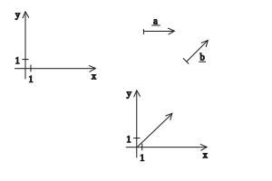
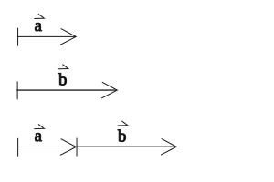
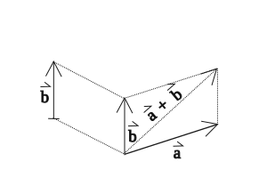

---

[Vissza](../matematika.md)

---

# Vektorok

Skaláris szorzat a koordináta rendszerben

Mivel a vektor párhuzamosan eltolható önmagával, ezért a kezdőpontja az origo.

## Paralelogramma szabály
A paralelogramma szabály két vektor összeadásának geometrikus módszere. Akkor a legcélszerűbb használni, ha a két vektor közös kezdőpontból indul.

### Az összegzés lépései
1. **Közös kezdőpont**: Helyezd el a két vektort ($a$ és $b$) úgy, hogy a kezdőpontjuk egybeessen ($O$ pont).
2. **Paralelogramma kiegészítés**: Rajzolj párhuzamos egyenest az $a$ vektor végpontján keresztül a $b$ vektorral, és a $b$ vektor végpontján keresztül az $a$ vektorral.
3. **Eredő vektor**: A közös kezdőpontból ($O$) a két párhuzamos egyenes metszéspontjába mutató átló adja a két vektor összegét ($c=a+b$).

A vektorok önmagukkal párhuzamosan eltolhatók.

Megjegyzendő "szabály": vég mínusz kezdet

---

## Legfontosabb alapfogalmak és definíciók
- **Vektor**: Irányított szakasz. Rendelkezik nagysággal (hosszal), iránnyal és állással.
- **Vektor hossza (abszolút értéke / normája)**: A vektort ábrázoló szakasz hossza. Jelölése: $\vert\vec{a}\vert$ vagy $\|\vec{a}\|$.
- **Nullvektor**: Olyan vektor, amelynek a hossza $0$, és az iránya határozatlan (tetszőleges irányúnak tekinthető). Jelölése: $\vec{0}$.
- **Egységvektor**: Olyan vektor, amelynek a hossza pontosan $1$ egység. Jelölése gyakran: $\vec{e}$.
- **Ellentett vektor**: Az $\vec{a}$ vektor ellentettje az a $-\vec{a}$ vektor, amelynek hossza és állása megegyezik $\vec{a}$-éval, de az iránya ellentétes.
- **Egyenlő vektorok**: Két vektor egyenlő, ha a hosszuk és az irányuk is megegyezik (párhuzamos eltolással egymásba vihetők).
- **Egyállású (kollineáris) vektorok**: Olyan vektorok, amelyek párhuzamos egyeneseken vagy ugyanazon az egyenesen fekszenek.
- **Helyvektor**: A koordináta-rendszer origójából egy adott $P$ pontba mutató vektor. A helyvektor koordinátái megegyeznek a pont koordinátáival: $\vec{r}_p = (x, y)$.
- **Skaláris szorzat**: Két vektor skaláris szorzata egy szám (skalár), amely a két vektor hosszának és a köztük lévő szög koszinuszának a szorzata: $\vec{a} \cdot \vec{b} = \vert\vec{a}\vert \cdot \vert\vec{b}\vert \cdot \cos(\alpha)$.
- **Meredekségi / Irányvektor**: Egy egyenessel párhuzamos, nem nullvektor, amely kijelöli az egyenes irányát.
- **Normálvektor**: Egy adott egyenesre vagy síkra merőleges, nem nullvektor.

---

## Két vektor hajlásszögének kiszámítása

$\vec{a} = (4, -3)$

$\vec{b} = (12, -5)$

$a \cdot b = 4 \cdot 12 + (-3) \cdot (-5) = 48 + 15 = 63$

$\|\vec{a}\| = \sqrt{4^{2} + (-3)^{2}} = \sqrt{16 + 9} = \sqrt{25} = 5$

$\|\vec{b}\| = \sqrt{12^{2} + (-5)^{2}} = \sqrt{144 + 25} = \sqrt{169} = 13$

$cos \gamma = \frac{a \cdot b}{\|\vec{a}\| \cdot \|\vec{b}\|} = \frac{63}{5 \cdot 13} = \frac{63}{65} = 0.9692$

$\gamma = cos(0.9692)^{-1} \approx 14.26^{\circ}$

---

$\|\vec{a}\| = (-0.5, -3)$

$\|\vec{b}\| = (12, -1.4)$

$a \cdot b = (-0.5) \cdot 12 + (-3) \cdot (-1.4) = -1.8$

$\|\vec{a}\| = \sqrt{(-0.5)^{2} + (-3)^{2}} = \sqrt{9.25}$

$\|\vec{b}\| = \sqrt{12^{2} + (-1.4)^{2}} = \sqrt{145.96}$

$cos\gamma = \frac{-1.8}{\sqrt{9.25} \cdot \sqrt{145.96}} = \frac{-1.8}{36.7441} = -0.0489$

$\gamma \approx 92.80^{\circ}$

---
