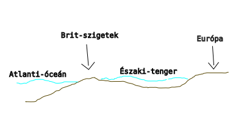

---

# Óceánok és tengerek

---

> Jeges-tenger -> Jeges-óceán, Antarktiszt övező terület -> Déli-óceán

> Óceán:
> - Általános mélységük 4-5000m
> - áramlási rendszerük van
> - átlagos sótartalmuk $35-38 °/$_{oo}$

> Tenger:
> -szigetekkel, félszigetekkel, szorosokkal határolódnak el az óceántól.
> - nincs számottevő áramlásuk
> - sótartalmuk változó $1-41$ °/$_{oo}$

> Beltenger:
> - földrészek között vagy földrészen belül találhatóak
> - pl.: Földközi-tenger, Vörös-tenger, Fekete-tenger, Kaszpi-tenger, Balti-tenger

> Perem tenger
> - földrészeket kísérő kis vízborítású vízfelületek
> - pl.: Északi-tenger
>
> 

> Sós tengerek
> - száraz meleg területeken a jelentős párolgás miatt

> Édes tengerek
> - csapadékos hideg területeken